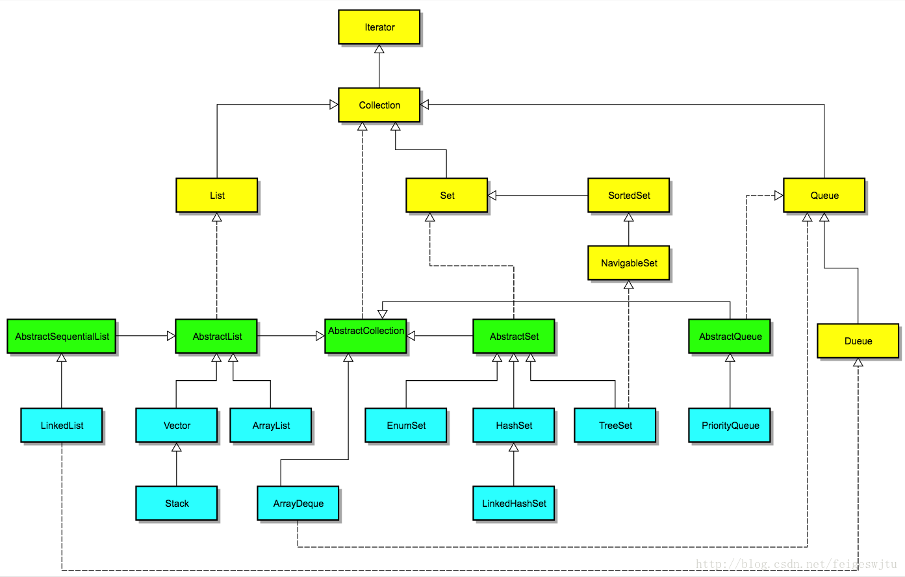
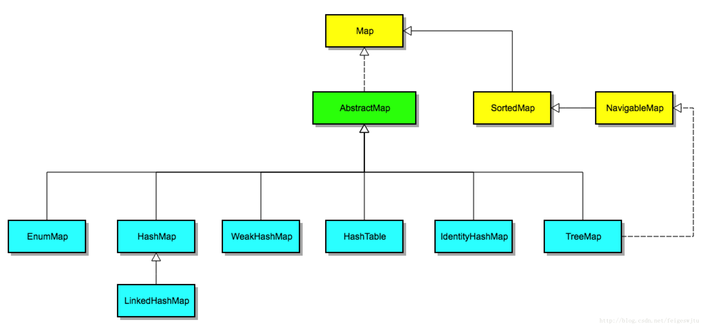

# 概况
容器，顾名思义，就是可以容纳东西的器物，在Java语言中就是可以容纳其他Java对象的对象，优点有很多：

 - 降低编程难度
 - 提高程序性能
 - 提高API间的互操作性
 - 降低学习难度
 - 降低设计和实现相关API的难度
 - 增加程序的重用性

Java容器里只能放对象，对于基本类型（byte, int, long, float, double等），需要将其包装成其对象类型后（Integer, Long, Float, Double等）才能放到容器里。大多数情况拆箱和装箱都能够自动完成。这虽然会简化了设计和编程，但是会导致额外的性能和空间开销，所以注意这点，拆箱和装箱自动完成是基于编译器的语法糖实现的，感兴趣的可以看我的另外[一篇文章](./syntactic_sugar.md)。

# 泛型（Generics）
Java容器能够容纳任何类型的对象，通过源码可以看出每个容器都是泛型编程，Java泛型不是什么神奇的东西，只是编译器为我们提供的一个“[语法糖](./syntactic_sugar.md)”。

泛型本身并不需要Java虚拟机的支持，只需要在编译阶段做一下简单的字符串替换即可。但是实质上，Java的单继承机制才是保证这一特性的根本，因为所有的对象都是Object的子类，容器里只要能够存放Object对象就行了。所以，所有容器的内部存放的都是Object对象，泛型机制只是简化了编程，由编译器自动帮我们完成了强制类型转换而已。JDK 1.4以及之前版本不支持泛型，类型转换需要程序员显式完成。

# 内存管理
跟C/C++复杂的内存管理机制不同，Java GC自动包揽了一切，Java程序并不需要处理令人头疼的内存问题，因此JCF并不像C++ STL那样需要专门的空间适配器（alloctor）。 另外，由于Java里对象都在堆上，且对象只能通过引用（reference，跟C++中的引用不是同一个概念，可以理解成经过包装后的指针）访问，容器里放的其实是对象的引用而不是对象本身，也就不存在C++容器的复制拷贝问题。

# 接口和实现（Interfaces and Implementations）

Java的容器框架针对各种使用场景都有特定的接口和实现，比如是否有序、是否可以重复、是否可以导航、是否是线程安全等。我将花多个篇幅基于源码讲解一下Java集合框架的特性和使用注意事项，这系列文章暂时只讲解`java.util.*`下相关的实现，至于线程安全相关的`java.util.concurrent.*` 后续我讲解并发编程锁相关知识时再讲解。

# 容器Collection框架结构图
直接或者间接实现接口Iterator的类都是以列表形式存放元素的容器，比如List、Set、Queue等等。
下图是Collection的类结构图图(JDK1.8):

# 容器Map框架结构图
直接或者间接实现接口Map的类都是以键值对(KEY-VALUE)的形式存放元素的容器，比如SortedMap、NavigableMap等等。
下图是Map的类结构图(JDK1.8):

# 工具类
除了上面介绍的类图之外，Java的容器框架也提供了一些工具类，比如Collections, Arrays等，后续我们慢慢介绍它们的一些使用方法。

