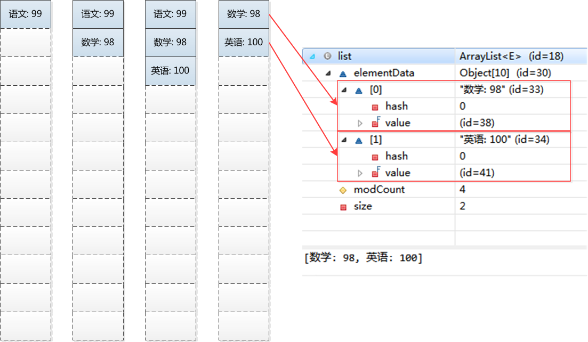

# ArrayList一些说法

顾名思义，以数组实现。节约空间，但数组有容量限制。超出限制时会增加50%容量，用System.arraycopy（）复制到新的数组。因此最好能给出数组大小的预估值。默认第一次插入元素时创建大小为10的数组。
按数组下标访问元素－get(i）、set(i, e) 的性能很高，这是数组的基本优势。
如果按下标插入元素、删除元素－add（i,e）、 remove（i）、remove（e），则要用System.arraycopy（）来复制移动部分受影响的元素，性能就变差了。
越是前面的元素，修改时要移动的元素越多。直接在数组末尾加入元素－常用的add（e），删除最后一个元素则无影响。

我们先通过一段简单的代码来看下内存变化。
```java
List<String> list = new ArrayList<>();
list.add("语文: 99");
list.add("数学: 98");
list.add("英语: 100");
list.remove(0);
```

内存变化图:


其中，add操作可以理解为直接将数组的内容置位，remove操作可以理解为删除index为0的节点，并将后面元素移到0处。


ArrayList的类声明如下:
```java
public class ArrayList<E> extends AbstractList<E>
        implements List<E>, RandomAccess, Cloneable, java.io.Serializable
{
    //...
}
```

实现了List接口，说明ArrayList是List的一个实现类，实现了RandomAccess([RandomAccess接口说明](./RandomAccess.md))说明ArrayList支持随机访问。

# ArrayList初始化
ArrayList重载了多个构造方法，我们挑两个介绍一下。
```java
    /**
     * 默认初始化容量
     */
    private static final int DEFAULT_CAPACITY = 10;

    /**
     * ArrayList共享的空数组，这样节省内存
     */
    private static final Object[] EMPTY_ELEMENTDATA = {};

    /**
     * 如果使用默认size时，共享的空数组
     * 第一个元素增加时会重新初始化elementData
     */
    private static final Object[] DEFAULTCAPACITY_EMPTY_ELEMENTDATA = {};

    /**
     * 真正存储的数组
     */
    transient Object[] elementData; // non-private to simplify nested class access

    /**
     * List的元素数量
     */
    private int size;

     /**
     * 带有初始化容量的构造方法
     */
    public ArrayList(int initialCapacity) {
        if (initialCapacity > 0) {
            this.elementData = new Object[initialCapacity];
        } else if (initialCapacity == 0) {
            this.elementData = EMPTY_ELEMENTDATA;
        } else {
            throw new IllegalArgumentException("Illegal Capacity: "+
                                               initialCapacity);
        }
    }

     /**
     * 使用默认容量的构造方法，在放入第一个元素时进行初始化
     */
    public ArrayList() {
        this.elementData = DEFAULTCAPACITY_EMPTY_ELEMENTDATA;
    }
```

# ArrayList的add方法
当然我们向ArrayList放入元素时，会使用add方法，这个方法会把元素放在队尾，源码如下:
```java
    public boolean add(E e) {
        ensureCapacityInternal(size + 1);  // Increments modCount!!
        elementData[size++] = e;
        return true;
    }
```
代码表面很简单，但是有一个稍微复杂的ensureCapacityInternal方法，可以看出ensureCapacityInternal方法才是add的核心，这段代码就是用来扩容的，代码如下:

```java
    // 计算最小扩容的大小
    private static int calculateCapacity(Object[] elementData, int minCapacity) {
        //如果List初始化之后还未进行过插入操作，返回默认容量和扩容容量的最大的值
        if (elementData == DEFAULTCAPACITY_EMPTY_ELEMENTDATA) {
            return Math.max(DEFAULT_CAPACITY, minCapacity);
        }
        return minCapacity;
    }
    // 扩容操作入口
    private void ensureCapacityInternal(int minCapacity) {
        ensureExplicitCapacity(calculateCapacity(elementData, minCapacity));
    }

    // 真正的扩容操作
    private void ensureExplicitCapacity(int minCapacity) {
        // 修改次数+1
        modCount++;

        // 如果扩容的容量大于已经存在的容量，则才进行扩容
        if (minCapacity - elementData.length > 0)
            grow(minCapacity);
    }

    private void grow(int minCapacity) {
        // overflow-conscious code
        int oldCapacity = elementData.length;
        // 扩展为原来的1.5倍
        int newCapacity = oldCapacity + (oldCapacity >> 1);
        // 如果扩为1.5倍还不满足需求，直接扩为需求值
        if (newCapacity - minCapacity < 0)
            newCapacity = minCapacity;
        if (newCapacity - MAX_ARRAY_SIZE > 0)
            newCapacity = hugeCapacity(minCapacity);
        // minCapacity is usually close to size, so this is a win:
        elementData = Arrays.copyOf(elementData, newCapacity);
    }
```

# ArrayList的get和set方法

get和set操作比较简单了，就是对下标对应的元素进行set和get操作。
```java
    public E get(int index) {
        rangeCheck(index);

        return elementData(index);
    }

    public E set(int index, E element) {
        rangeCheck(index);

        E oldValue = elementData(index);
        elementData[index] = element;
        return oldValue;
    }
```

在这两个方法的最前面会校验一下传入的下标(index)是否合法，如果不再合法的范围内会抛出异常IndexOutOfBoundsException。
```java
    private void rangeCheck(int index) {
        if (index >= size)
            throw new IndexOutOfBoundsException(outOfBoundsMsg(index));
    }
```

# remove方法

最后介绍一下remove方法:
```java
    public E remove(int index) {
        //检测下标值(index)的合法性
        rangeCheck(index);

        modCount++;
        E oldValue = elementData(index);

        int numMoved = size - index - 1;
        //如果remove的不是最后一个元素，把后面的往前移动
        if (numMoved > 0)
            System.arraycopy(elementData, index+1, elementData, index,
                             numMoved);
        //下标对应的值赋值为null，以便于GC可以回收这个对象占用的内存
        elementData[--size] = null; // clear to let GC do its work

        return oldValue;
    }
```

# ArrayList不是线程安全的

最后说明一下ArrayList不是线程安全的，如果要做到线程安全，需要我们自己对ArrayList进行加锁操作，或者使用锁或者使用synchronized，另外还可以用Collections提供的synchronizedList()进行操作，实际上synchronizedList()方法就是使用了synchronized进行并发控制的，只是对我们开发者来说使用起来更方便了。


