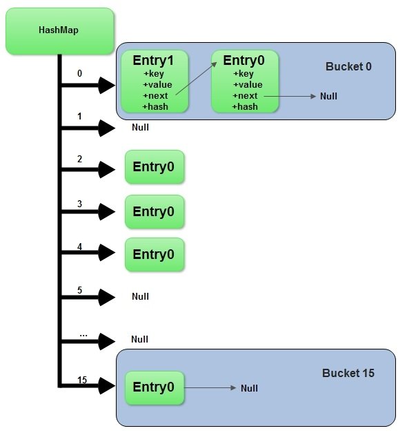

# 什么是HashMap?
HashMap是基于哈希表的Map接口的非同步实现。此实现提供所有可选的映射操作，并允许使用null值和null键。此类不保证映射的顺序，特别是它不保证该顺序恒久不变。

# HashMap的数据结构
在Java编程语言中，最基本的结构就是两种，一个是数组，另外一个是模拟指针（引用），所有的数据结构都可以用这两个基本结构来构造的，HashMap也不例外。HashMap实际上是一个“链表散列”的数据结构，即数组和链表的结合体。

文字描述永远要配上图才能更好的讲解数据结构，HashMap的结构图如下。


从上图中可以看出，HashMap底层就是一个数组结构，数组中的每一项又是一个链表或者红黑树。
当新建一个HashMap的时候，就会初始化一个数组。

下面先通过大概看下HashMap的核心成员。

```java
public class HashMap<K,V> extends AbstractMap<K,V>
    implements Map<K,V>, Cloneable, Serializable {

    // 默认容量，默认为16，必须是2的幂
    static final int DEFAULT_INITIAL_CAPACITY = 1 << 4;

    // 最大容量，值是2^30
    static final int MAXIMUM_CAPACITY = 1 << 30

    // 装载因子，默认的装载因子是0.75
    static final float DEFAULT_LOAD_FACTOR = 0.75f;

    // 解决冲突的数据结构由链表转换成树的阈值，默认为8
    static final int TREEIFY_THRESHOLD = 8;

    // 解决冲突的数据结构由树转换成链表的阈值，默认为6
    static final int UNTREEIFY_THRESHOLD = 6;

    /* 当桶中的bin被树化时最小的hash表容量。
     *  如果没有达到这个阈值，即hash表容量小于MIN_TREEIFY_CAPACITY，当桶中bin的数量太多时会执行resize扩容操作。
     *  这个MIN_TREEIFY_CAPACITY的值至少是TREEIFY_THRESHOLD的4倍。
     */
    static final int MIN_TREEIFY_CAPACITY = 64;

    static class Node<K,V> implements Map.Entry<K,V> {
        //...
    }
    // 存储数据的数组
    transient Node<K,V>[] table;

    // 遍历的容器
    transient Set<Map.Entry<K,V>> entrySet;

    // Map中KEY-VALUE的数量
    transient int size;

    /**
     * 结构性变更的次数。
     * 结构性变更是指map的元素数量的变化，比如rehash操作。
     * 用于HashMap快速失败操作，比如在遍历时发生了结构性变更，就会抛出ConcurrentModificationException。
     */
    transient int modCount;

    // 下次resize的操作的size值。
    int threshold;

    // 负载因子，resize后容量的大小会增加现有size * loadFactor
    final float loadFactor;
}
```
# HashMap的初始化
```java
    public HashMap() {
        this.loadFactor = DEFAULT_LOAD_FACTOR; // 其他值都是默认值
    }
```
通过源码可以看出初始化时并没有初始化数组table，那只能在put操作时放入了，为什么要这样做？估计是避免初始化了HashMap之后不使用反而占用内存吧，哈哈哈。

# HashMap的存储操作
```java
    public V put(K key, V value) {
        return putVal(hash(key), key, value, false, true);
    }
```
下面我们详细讲一下HashMap是如何确定数组索引的位置、进行put操作的详细过程以及扩容机制(resize)
## hash计算，确定数组索引位置

不管增加、删除、查找键值对，定位到哈希桶数组的位置都是很关键的第一步。前面说过HashMap的数据结构是数组和链表的结合，所以我们当然希望这个HashMap里面的元素位置尽量分布均匀些，尽量使得每个位置上的元素数量只有一个，那么当我们用hash算法求得这个位置的时候，马上就可以知道对应位置的元素就是我们要的，不用遍历链表，大大优化了查询的效率。HashMap定位数组索引位置，直接决定了hash方法的离散性能。

看下源码的实现:

```java
static final int hash(Object key) {   //jdk1.8
     int h;
     // h = key.hashCode() 为第一步 取hashCode值
     // h ^ (h >>> 16)  为第二步 高位参与运算
     return (key == null) ? 0 : (h = key.hashCode()) ^ (h >>> 16);
}
```
通过hashCode()的高16位异或低16位实现的：(h = k.hashCode()) ^ (h >>> 16)，主要是从速度、功效、质量来考虑的，这么做可以在数组table的length比较小的时候，也能保证考虑到高低Bit都参与到Hash的计算中，同时不会有太大的开销。

大家都知道上面代码里的key.hashCode()函数调用的是key键值类型自带的哈希函数，返回int型散列值。
理论上散列值是一个int型，如果直接拿散列值作为下标访问HashMap主数组的话，考虑到2进制32位带符号的int表值范围从‑2147483648到2147483648。前后加起来大概40亿的映射空间。只要哈希函数映射得比较均匀松散，一般应用是很难出现碰撞的。但问题是一个40亿长度的数组，内存是放不下的。你想，HashMap扩容之前的数组初始大小才16。所以这个散列值是不能直接拿来用的。用之前还要先做对数组的长度取模运算，得到的余数才能用来访问数组下标。源码中模运算是在这个indexFor( )函数里完成。

```java
bucketIndex = indexFor(hash, table.length);
//indexFor的代码也很简单，就是把散列值和数组长度做一个"与"操作，
static int indexFor(int h, int length) {
   return h & (length-1);
}
```

顺便说一下，这也正好解释了为什么HashMap的数组长度要取2的整次幂。因为这样（数组长度‑1）正好相当于一个“低位掩码”。“与”操作的结果就是散列值的高位全部归零，只保留低位值，用来做数组下标访问。以初始长度16为例，16‑1=15。2进制表示是00000000 0000000000001111。和某散列值做“与”操作如下，结果就是截取了最低的四位值。

```data
  10100101 11000100 00100101
& 00000000 00000000 00001111
----------------------------------
  00000000 00000000 00000101 //高位全部归零，只保留末四位
```
但这时候问题就来了，这样就算我的散列值分布再松散，要是只取最后几位的话，碰撞也会很严重。更要命的是如果散列本身做得不好，分布上成等差数列的漏洞，恰好使最后几个低位呈现规律性重复，就无比蛋疼。这时候“扰动函数”的价值就出来了，说到这大家应该都明白了，看下图。


右位移16位，正好是32bit的一半，自己的高半区和低半区做异或，就是为了混合原始哈希码的高位和低位，以此来加大低位的随机性。而且混合后的低位掺杂了高位的部分特征，这样高位的信息也被变相保留下来。

## putVal方法
HashMap的put方法执行过程可以通过下图来理解，自己有兴趣可以去对比源码更清楚地研究学习。


源码以及解释如下:

```java
    // 真正的put操作
    final V putVal(int hash, K key, V value, boolean onlyIfAbsent,
                   boolean evict) {
        Node<K,V>[] tab; Node<K,V> p; int n, i;
        // 如果table没有初始化，或者初始化的大小为0，进行resize操作
        if ((tab = table) == null || (n = tab.length) == 0)
            n = (tab = resize()).length;
        // 如果hash值对应的桶内没有数据，直接生成结点并且把结点放入桶中
        if ((p = tab[i = (n - 1) & hash]) == null)
            tab[i] = newNode(hash, key, value, null);
        // 如果hash值对应的桶内有数据解决冲突，再放入桶中
        else {
            Node<K,V> e; K k;
            //判断put的元素和已经存在的元素是相同(hash一致，并且equals返回true)
            if (p.hash == hash &&
                ((k = p.key) == key || (key != null && key.equals(k))))
                e = p;
            // put的元素和已经存在的元素是不相同(hash一致，并且equals返回true)
            // 如果桶内元素的类型是TreeNode，也就是解决hash解决冲突用的树型结构，把元素放入树种
            else if (p instanceof TreeNode)
                e = ((TreeNode<K,V>)p).putTreeVal(this, tab, hash, key, value);
            else {
                // 桶内元素的类型不是TreeNode，而是链表时，把数据放入链表的最后一个元素上
                for (int binCount = 0; ; ++binCount) {
                    if ((e = p.next) == null) {
                        p.next = newNode(hash, key, value, null);
                        // 如果链表的长度大于转换为树的阈值(TREEIFY_THRESHOLD)，将存储元素的数据结构变更为树
                        if (binCount >= TREEIFY_THRESHOLD - 1) // -1 for 1st
                            treeifyBin(tab, hash);
                        break;
                    }
                    // 如果查已经存在key，停止遍历
                    if (e.hash == hash &&
                        ((k = e.key) == key || (key != null && key.equals(k))))
                        break;
                    p = e;
                }
            }
            // 已经存在元素时
            if (e != null) { // existing mapping for key
                V oldValue = e.value;
                if (!onlyIfAbsent || oldValue == null)
                    e.value = value;
                afterNodeAccess(e);
                return oldValue;
            }
        }
        ++modCount;
        // 如果K-V数量大于阈值，进行resize操作
        if (++size > threshold)
            resize();
        afterNodeInsertion(evict);
        return null;
    }
```

## 扩容机制

HashMap的扩容机制用的很巧妙，以最小的性能来完成扩容。
扩容后的容量就变成了变成了之前容量的2倍，初始容量为16，所以经过rehash之后，元素的位置要么是在原位置，要么是在原位置再向高下标移动上次容量次数的位置，也就是说如果上次容量是16，下次扩容后容量变成了16+16，如果一个元素在下标为7的位置，下次扩容时，要不还在7的位置，要不在7+16的位置。

我们下面来解释一下Java8的扩容机制是怎么做到的？
n为table的长度，图（a）表示扩容前的key1和key2两种key确定索引位置的示例，图（b）表示扩容后key1和key2两种key确定索引位置的示例，其中hash1是key1对应的哈希与高位运算结果。


元素在重新计算hash之后，因为n变为2倍，那么n-1的mask范围在高位多1bit(红色)，因此新的index就会发生这样的变化：


因此，我们在扩充HashMap的时候，不需要像JDK1.7的实现那样重新计算hash，只需要看看原来的hash值新增的那个bit是1还是0就好了，是0的话索引没变，是1的话索引变成“原索引+oldCap”，可以看看下图为16扩充为32的resize示意图：

而hash值的高位是否为1，只需要和扩容后的长度做与操作就可以了，因为扩容后的长度为2的次幂，所以高位必为1，低位必为0，如10000这种形式，源码中有`e.hash & oldCap`来做到这个逻辑。

这个设计确实非常的巧妙，既省去了重新计算hash值的时间，而且同时，由于新增的1bit是0还是1可以认为是随机的，因此resize的过程，均匀的把之前的冲突的节点分散到新的bucket了。这一块就是JDK1.8新增的优化点。有一点注意区别，JDK1.7中rehash的时候，旧链表迁移新链表的时候，如果在新表的数组索引位置相同，则链表元素会倒置，但是从上图可以看出，JDK1.8不会倒置。
下面是JDK1.8的resize源码，写的很赞，如下:

```java
    final Node<K,V>[] resize() {
        Node<K,V>[] oldTab = table;
        int oldCap = (oldTab == null) ? 0 : oldTab.length;
        int oldThr = threshold;
        int newCap, newThr = 0;
        // 计算新的容量值和下一次要扩展的容量
        if (oldCap > 0) {
        // 超过最大值就不再扩充了，就只好随你碰撞去吧
            if (oldCap >= MAXIMUM_CAPACITY) {
                threshold = Integer.MAX_VALUE;
                return oldTab;
            }
            // 没超过最大值，就扩充为原来的2倍
            else if ((newCap = oldCap << 1) < MAXIMUM_CAPACITY &&
                     oldCap >= DEFAULT_INITIAL_CAPACITY)
                newThr = oldThr << 1; // double threshold
        }
        else if (oldThr > 0) // initial capacity was placed in threshold
            newCap = oldThr;
        else {               // zero initial threshold signifies using defaults
            newCap = DEFAULT_INITIAL_CAPACITY;
            newThr = (int)(DEFAULT_LOAD_FACTOR * DEFAULT_INITIAL_CAPACITY);
        }
        // 计算新的resize上限
        if (newThr == 0) {
            float ft = (float)newCap * loadFactor;
            newThr = (newCap < MAXIMUM_CAPACITY && ft < (float)MAXIMUM_CAPACITY ?
                      (int)ft : Integer.MAX_VALUE);
        }
        threshold = newThr;
        @SuppressWarnings({"rawtypes","unchecked"})
            Node<K,V>[] newTab = (Node<K,V>[])new Node[newCap];
        table = newTab;
        if (oldTab != null) {
            // 把每个bucket都移动到新的buckets中
            for (int j = 0; j < oldCap; ++j) {
                Node<K,V> e;
                //如果位置上没有元素，直接为null
                if ((e = oldTab[j]) != null) {
                    oldTab[j] = null;
                    //如果只有一个元素，新的hash计算后放入新的数组中
                    if (e.next == null)
                        newTab[e.hash & (newCap - 1)] = e;
                    //如果是树状结构，使用红黑树保存
                    else if (e instanceof TreeNode)
                        ((TreeNode<K,V>)e).split(this, newTab, j, oldCap);
                    //如果是链表形式
                    else { // preserve order
                        Node<K,V> loHead = null, loTail = null;
                        Node<K,V> hiHead = null, hiTail = null;
                        Node<K,V> next;
                        do {
                            next = e.next;
                            //hash碰撞后高位为0，放入低Hash值的链表中
                            if ((e.hash & oldCap) == 0) {
                                if (loTail == null)
                                    loHead = e;
                                else
                                    loTail.next = e;
                                loTail = e;
                            }
                            //hash碰撞后高位为1，放入高Hash值的链表中
                            else {
                                if (hiTail == null)
                                    hiHead = e;
                                else
                                    hiTail.next = e;
                                hiTail = e;
                            }
                        } while ((e = next) != null);
                        // 低hash值的链表放入数组的原始位置
                        if (loTail != null) {
                            loTail.next = null;
                            newTab[j] = loHead;
                        }
                        // 高hash值的链表放入数组的原始位置 + 原始容量
                        if (hiTail != null) {
                            hiTail.next = null;
                            newTab[j + oldCap] = hiHead;
                        }
                    }
                }
            }
        }
        return newTab;
    }
```


