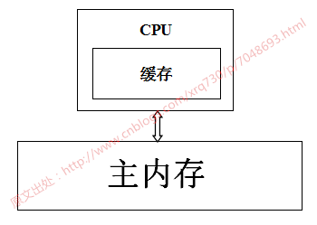
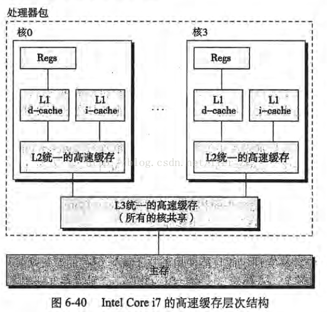
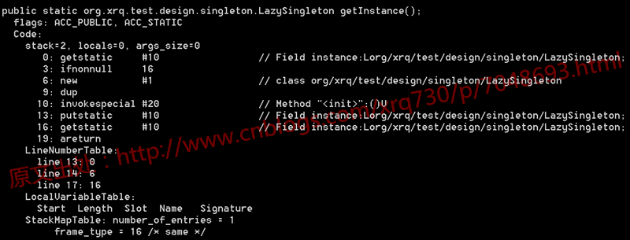
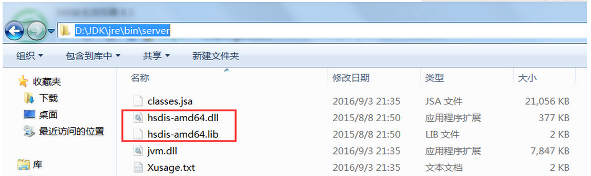
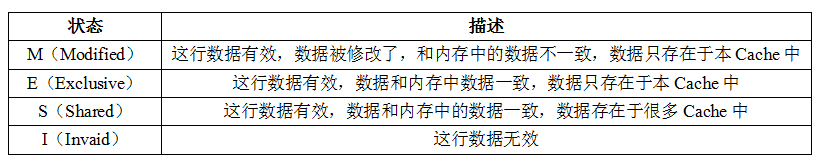
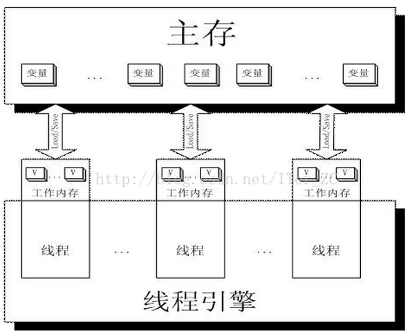

> 原文地址: http://www.cnblogs.com/xrq730/p/7048693.html 转载请注明出处，谢谢

# 前言

我们知道volatile关键字的作用是保证变量在多线程之间的可见性，它是java.util.concurrent包的核心，没有volatile就没有这么多的并发类给我们使用。

本文详细解读一下volatile关键字如何保证变量在多线程之间的可见性，在此之前，有必要讲解一下CPU缓存的相关知识，掌握这部分知识一定会让我们更好地理解volatile的原理，从而更好、更正确地地使用volatile关键字。

# CPU缓存

CPU缓存的出现主要是为了解决CPU运算速度与内存读写速度不匹配的矛盾，因为CPU运算速度要比内存读写速度快得多，举个例子：

* 一次主内存的访问通常在几十到几百个时钟周期
* 一次L1高速缓存的读写只需要1~2个时钟周期
* 一次L2高速缓存的读写也只需要数十个时钟周期
* 这种访问速度的显著差异，导致CPU可能会花费很长时间等待数据到来或把数据写入内存。

基于此，现在CPU大多数情况下读写都不会直接访问内存（CPU都没有连接到内存的管脚），取而代之的是CPU缓存，CPU缓存是位于CPU与内存之间的临时存储器，它的容量比内存小得多但是交换速度却比内存快得多。而缓存中的数据是内存中的一小部分数据，但这一小部分是短时间内CPU即将访问的，当CPU调用大量数据时，就可先从缓存中读取，从而加快读取速度。

按照读取顺序与CPU结合的紧密程度，CPU缓存可分为：

* 一级缓存：简称L1 Cache，位于CPU内核的旁边，是与CPU结合最为紧密的CPU缓存
* 二级缓存：简称L2 Cache，分内部和外部两种芯片，内部芯片二级缓存运行速度与主频相同，外部芯片二级缓存运行速度则只有主频的一半
* 三级缓存：简称L3 Cache，部分高端CPU才有

每一级缓存中所存储的数据全部都是下一级缓存中的一部分，这三种缓存的技术难度和制造成本是相对递减的，所以其容量也相对递增。

当CPU要读取一个数据时，首先从一级缓存中查找，如果没有再从二级缓存中查找，如果还是没有再从三级缓存中或内存中查找。一般来说每级缓存的命中率大概都有80%左右，也就是说全部数据量的80%都可以在一级缓存中找到，只剩下20%的总数据量才需要从二级缓存、三级缓存或内存中读取。

# 使用CPU缓存带来的问题

用一张图表示一下CPU-->CPU缓存-->主内存数据读取之间的关系：



当系统运行时，CPU执行计算的过程如下：

1. 程序以及数据被加载到主内存
2. 指令和数据被加载到CPU缓存
3. CPU执行指令，把结果写到高速缓存
4. 高速缓存中的数据写回主内存

如果服务器是单核CPU，那么这些步骤不会有任何的问题，但是如果服务器是多核CPU，那么问题来了，以Intel Core i7处理器的高速缓存概念模型为例（图片摘自《深入理解计算机系统》）：



试想下面一种情况：

1. 核0读取了一个字节，根据局部性原理，它相邻的字节同样被被读入核0的缓存
2. 核3做了上面同样的工作，这样核0与核3的缓存拥有同样的数据
3. 核0修改了那个字节，被修改后，那个字节被写回核0的缓存，但是该信息并没有写回主存
4. 核3访问该字节，由于核0并未将数据写回主存，数据不同步

为了解决这个问题，CPU制造商制定了一个规则：当一个CPU修改缓存中的字节时，服务器中其他CPU会被通知，它们的缓存将视为无效。于是，在上面的情况下，核3发现自己的缓存中数据已无效，核0将立即把自己的数据写回主存，然后核3重新读取该数据。

# 反汇编Java字节码，查看汇编层面对volatile关键字做了什么

有了上面的理论基础，我们可以研究volatile关键字到底是如何实现的。首先写一段简单的代码：
```java
public class LazySingleton {

    private static volatile LazySingleton instance = null;

    public static LazySingleton getInstance() {
        if (instance == null) {
            instance = new LazySingleton();
        }

        return instance;
    }

    public static void main(String[] args) {
        LazySingleton.getInstance();
    }
}
```

首先反编译一下这段代码的.class文件，看一下生成的字节码：



没有任何特别的。要知道，字节码指令，比如上图的getstatic、ifnonnull、new等，最终对应到操作系统的层面，都是转换为一条一条指令去执行，我们使用的PC机、应用服务器的CPU架构通常都是IA-32架构的，这种架构采用的指令集是CISC（复杂指令集），而汇编语言则是这种指令集的助记符。

因此，既然在字节码层面我们看不出什么端倪，那下面就看看将代码转换为汇编指令能看出什么端倪。Windows上要看到以上代码对应的汇编码不难（吐槽一句，说说不难，为了这个问题我找遍了各种资料，差点就准备安装虚拟机，在Linux系统上搞了），访问[hsdis工具路径](https://sourceforge.net/projects/fcml/files/fcml-1.1.1/hsdis-1.1.1-win32-amd64.zip/download)可直接下载hsdis工具，下载完毕之后解压，将hsdis-amd64.dll与hsdis-amd64.lib两个文件放在%JAVA_HOME%\jre\bin\server路径下即可，如下图：



然后跑main函数，跑main函数之前，加入如下虚拟机参数：
`-server -Xcomp -XX:+UnlockDiagnosticVMOptions -XX:+PrintAssembly -XX:CompileCommand=compileonly,*LazySingleton.getInstance`

```java
Java HotSpot(TM) 64-Bit Server VM warning: PrintAssembly is enabled; turning on DebugNonSafepoints to gain additional output
CompilerOracle: compileonly *LazySingleton.getInstance
Loaded disassembler from D:\JDK\jre\bin\server\hsdis-amd64.dll
Decoding compiled method 0x0000000002931150:
Code:
Argument 0 is unknown.RIP: 0x29312a0 Code size: 0x00000108
[Disassembling for mach='amd64']
[Entry Point]
[Verified Entry Point]
[Constants]
  # {method} 'getInstance' '()Lorg/xrq/test/design/singleton/LazySingleton;' in 'org/xrq/test/design/singleton/LazySingleton'
  #           [sp+0x20]  (sp of caller)
  0x00000000029312a0: mov     dword ptr [rsp+0ffffffffffffa000h],eax
  0x00000000029312a7: push    rbp
  0x00000000029312a8: sub     rsp,10h           ;*synchronization entry
                                                ; - org.xrq.test.design.singleton.LazySingleton::getInstance@-1 (line 13)
  0x00000000029312ac: mov     r10,7ada9e428h    ;   {oop(a 'java/lang/Class' = 'org/xrq/test/design/singleton/LazySingleton')}
  0x00000000029312b6: mov     r11d,dword ptr [r10+58h]
                                                ;*getstatic instance
                                                ; - org.xrq.test.design.singleton.LazySingleton::getInstance@0 (line 13)
  0x00000000029312ba: test    r11d,r11d
  0x00000000029312bd: je      29312e0h
  0x00000000029312bf: mov     r10,7ada9e428h    ;   {oop(a 'java/lang/Class' = 'org/xrq/test/design/singleton/LazySingleton')}
  0x00000000029312c9: mov     r11d,dword ptr [r10+58h]
  0x00000000029312cd: mov     rax,r11
  0x00000000029312d0: shl     rax,3h            ;*getstatic instance
                                                ; - org.xrq.test.design.singleton.LazySingleton::getInstance@16 (line 17)
  0x00000000029312d4: add     rsp,10h
  0x00000000029312d8: pop     rbp
  0x00000000029312d9: test    dword ptr [330000h],eax  ;   {poll_return}
  0x00000000029312df: ret
  0x00000000029312e0: mov     rax,qword ptr [r15+60h]
  0x00000000029312e4: mov     r10,rax
  0x00000000029312e7: add     r10,10h
  0x00000000029312eb: cmp     r10,qword ptr [r15+70h]
  0x00000000029312ef: jnb     293135bh
  0x00000000029312f1: mov     qword ptr [r15+60h],r10
  0x00000000029312f5: prefetchnta byte ptr [r10+0c0h]
  0x00000000029312fd: mov     r11d,0e07d00b2h   ;   {oop('org/xrq/test/design/singleton/LazySingleton')}
  0x0000000002931303: mov     r10,qword ptr [r12+r11*8+0b0h]
  0x000000000293130b: mov     qword ptr [rax],r10
  0x000000000293130e: mov     dword ptr [rax+8h],0e07d00b2h
                                                ;   {oop('org/xrq/test/design/singleton/LazySingleton')}
  0x0000000002931315: mov     dword ptr [rax+0ch],r12d
  0x0000000002931319: mov     rbp,rax           ;*new  ; - org.xrq.test.design.singleton.LazySingleton::getInstance@6 (line 14)
  0x000000000293131c: mov     rdx,rbp
  0x000000000293131f: call    2907c60h          ; OopMap{rbp=Oop off=132}
                                                ;*invokespecial <init>
                                                ; - org.xrq.test.design.singleton.LazySingleton::getInstance@10 (line 14)
                                                ;   {optimized virtual_call}
  0x0000000002931324: mov     r10,rbp
  0x0000000002931327: shr     r10,3h
  0x000000000293132b: mov     r11,7ada9e428h    ;   {oop(a 'java/lang/Class' = 'org/xrq/test/design/singleton/LazySingleton')}
  0x0000000002931335: mov     dword ptr [r11+58h],r10d
  0x0000000002931339: mov     r10,7ada9e428h    ;   {oop(a 'java/lang/Class' = 'org/xrq/test/design/singleton/LazySingleton')}
  0x0000000002931343: shr     r10,9h
  0x0000000002931347: mov     r11d,20b2000h
  0x000000000293134d: mov     byte ptr [r11+r10],r12l
  0x0000000002931351: lock add dword ptr [rsp],0h  ;*putstatic instance
                                                ; - org.xrq.test.design.singleton.LazySingleton::getInstance@13 (line 14)
  0x0000000002931356: jmp     29312bfh
  0x000000000293135b: mov     rdx,703e80590h    ;   {oop('org/xrq/test/design/singleton/LazySingleton')}
  0x0000000002931365: nop
  0x0000000002931367: call    292fbe0h          ; OopMap{off=204}
                                                ;*new  ; - org.xrq.test.design.singleton.LazySingleton::getInstance@6 (line 14)
                                                ;   {runtime_call}
  0x000000000293136c: jmp     2931319h
  0x000000000293136e: mov     rdx,rax
  0x0000000002931371: jmp     2931376h
  0x0000000002931373: mov     rdx,rax           ;*new  ; - org.xrq.test.design.singleton.LazySingleton::getInstance@6 (line 14)
  0x0000000002931376: add     rsp,10h
  0x000000000293137a: pop     rbp
  0x000000000293137b: jmp     2932b20h          ;   {runtime_call}
[Stub Code]
  0x0000000002931380: mov     rbx,0h            ;   {no_reloc}
  0x000000000293138a: jmp     293138ah          ;   {runtime_call}
[Exception Handler]
  0x000000000293138f: jmp     292fca0h          ;   {runtime_call}
[Deopt Handler Code]
  0x0000000002931394: call    2931399h
  0x0000000002931399: sub     qword ptr [rsp],5h
  0x000000000293139e: jmp     2909000h          ;   {runtime_call}
  0x00000000029313a3: hlt
  0x00000000029313a4: hlt
  0x00000000029313a5: hlt
  0x00000000029313a6: hlt
  0x00000000029313a7: hlt
```

这么长长的汇编代码，可能大家不知道CPU在哪里做了手脚，没事不难，定位到59、60两行：

```java
0x0000000002931351: lock add dword ptr [rsp],0h  ;*putstatic instance
                                                ; - org.xrq.test.design.singleton.LazySingleton::getInstance@13 (line 14)

```

之所以定位到这两行是因为这里结尾写明了line 14，line 14即volatile变量instance赋值的地方。后面的add dword ptr [rsp],0h都是正常的汇编语句，意思是将双字节的栈指针寄存器+0，这里的关键就是add前面的lock指令，后面详细分析一下lock指令的作用和为什么加上lock指令后就能保证volatile关键字的内存可见性。


# lock指令做了什么

之前有说过IA-32架构，关于CPU架构的问题大家有兴趣的可以自己查询一下，这里查询一下IA-32手册关于lock指令的描述，没有IA-32手册的可以去这个地址下载IA-32手册下载地址，是个中文版本的手册。

我摘抄一下IA-32手册中关于lock指令作用的一些描述（因为lock指令的作用在手册中散落在各处，并不是在某一章或者某一节专门讲）：

```data
在修改内存操作时，使用LOCK前缀去调用加锁的读-修改-写操作，这种机制用于多处理器系统中处理器之间进行可靠的通讯，具体描述如下：
（1）在Pentium和早期的IA-32处理器中，LOCK前缀会使处理器执行当前指令时产生一个LOCK#信号，这种总是引起显式总线锁定出现
（2）在Pentium4、Inter Xeon和P6系列处理器中，加锁操作是由高速缓存锁或总线锁来处理。如果内存访问有高速缓存且只影响一个单独的高速缓存行，那么操作中就会调用高速缓存锁，而系统总线和系统内存中的实际区域内不会被锁定。同时，这条总线上的其它Pentium4、Intel Xeon或者P6系列处理器就回写所有已修改的数据并使它们的高速缓存失效，以保证系统内存的一致性。如果内存访问没有高速缓存且/或它跨越了高速缓存行的边界，那么这个处理器就会产生LOCK#信号，并在锁定操作期间不会响应总线控制请求

32位IA-32处理器支持对系统内存中的某个区域进行加锁的原子操作。这些操作常用来管理共享的数据结构（如信号量、段描述符、系统段或页表），两个或多个处理器可能同时会修改这些数据结构中的同一数据域或标志。处理器使用三个相互依赖的机制来实现加锁的原子操作：
1、保证原子操作
2、总线加锁，使用LOCK#信号和LOCK指令前缀
3、高速缓存相干性协议，确保对高速缓存中的数据结构执行原子操作（高速缓存锁）。这种机制存在于Pentium4、Intel Xeon和P6系列处理器中

IA-32处理器提供有一个LOCK#信号，会在某些关键内存操作期间被自动激活，去锁定系统总线。当这个输出信号发出的时候，来自其他处理器或总线代理的控制请求将被阻塞。软件能够通过预先在指令前添加LOCK前缀来指定需要LOCK语义的其它场合。
在Intel386、Intel486、Pentium处理器中，明确地对指令加锁会导致LOCK#信号的产生。由硬件设计人员来保证系统硬件中LOCK#信号的可用性，以控制处理器间的内存访问。
对于Pentinum4、Intel Xeon以及P6系列处理器，如果被访问的内存区域是在处理器内部进行高速缓存的，那么通常不发出LOCK#信号；相反，加锁只应用于处理器的高速缓存。

为显式地强制执行LOCK语义，软件可以在下列指令修改内存区域时使用LOCK前缀。当LOCK前缀被置于其它指令之前或者指令没有对内存进行写操作（也就是说目标操作数在寄存器中）时，会产生一个非法操作码异常（#UD）。
【1】位测试和修改指令（BTS、BTR、BTC）
【2】交换指令（XADD、CMPXCHG、CMPXCHG8B）
【3】自动假设有LOCK前缀的XCHG指令
【4】下列单操作数的算数和逻辑指令：INC、DEC、NOT、NEG
【5】下列双操作数的算数和逻辑指令：ADD、ADC、SUB、SBB、AND、OR、XOR
一个加锁的指令会保证对目标操作数所在的内存区域加锁，但是系统可能会将锁定区域解释得稍大一些。
软件应该使用相同的地址和操作数长度来访问信号量（用作处理器之间发送信号的共享内存）。例如，如果一个处理器使用一个字来访问信号量，其它处理器就不应该使用一个字节来访问这个信号量。
总线锁的完整性不收内存区域对齐的影响。加锁语义会一直持续，以满足更新整个操作数所需的总线周期个数。但是，建议加锁访问应该对齐在它们的自然边界上，以提升系统性能：
【1】任何8位访问的边界（加锁或不加锁）
【2】锁定的字访问的16位边界
【3】锁定的双字访问的32位边界
【4】锁定的四字访问的64位边界
对所有其它的内存操作和所有可见的外部事件来说，加锁的操作都是原子的。所有取指令和页表操作能够越过加锁的指令。加锁的指令可用于同步一个处理器写数据而另一个处理器读数据的操作。


IA-32架构提供了几种机制用来强化或弱化内存排序模型，以处理特殊的编程情形。这些机制包括：
【1】I/O指令、加锁指令、LOCK前缀以及串行化指令等，强制在处理器上进行较强的排序
【2】SFENCE指令（在Pentium III中引入）和LFENCE指令、MFENCE指令（在Pentium4和Intel Xeon处理器中引入）提供了某些特殊类型内存操作的排序和串行化功能
...（这里还有两条就不写了）
这些机制可以通过下面的方式使用。
总线上的内存映射设备和其它I/O设备通常对向它们缓冲区写操作的顺序很敏感，I/O指令（IN指令和OUT指令）以下面的方式对这种访问执行强写操作的排序。在执行了一条I/O指令之前，处理器等待之前的所有指令执行完毕以及所有的缓冲区都被都被写入了内存。只有取指令和页表查询能够越过I/O指令，后续指令要等到I/O指令执行完毕才开始执行。
```

反复思考IA-32手册对lock指令作用的这几段描述，可以得出lock指令的几个作用：

1. 锁总线，其它CPU对内存的读写请求都会被阻塞，直到锁释放，不过实际后来的处理器都采用锁缓存替代锁总线，因为锁总线的开销比较大，锁总线期间其他CPU没法访问内存
2. lock后的写操作会回写已修改的数据，同时让其它CPU相关缓存行失效，从而重新从主存中加载最新的数据
3. 不是内存屏障却能完成类似内存屏障的功能，阻止屏障两遍的指令重排序
（1）中写了由于效率问题，实际后来的处理器都采用锁缓存来替代锁总线，这种场景下多缓存的数据一致是通过缓存一致性协议来保证的，我们来看一下什么是缓存一致性协议。

# 缓存一致性协议

讲缓存一致性之前，先说一下缓存行的概念：

* 缓存是分段（line）的，一个段对应一块存储空间，我们称之为缓存行，它是CPU缓存中可分配的最小存储单元，大小32字节、64字节、128字节不等，这与CPU架构有关，通常来说是64字节。当CPU看到一条读取内存的指令时，它会把内存地址传递给一级数据缓存，一级数据缓存会检查它是否有这个内存地址对应的缓存段，如果没有就把整个缓存段从内存（或更高一级的缓存）中加载进来。注意，这里说的是一次加载整个缓存段，这就是上面提过的局部性原理

上面说了，LOCK#会锁总线，实际上这不现实，因为锁总线效率太低了。因此最好能做到：使用多组缓存，但是它们的行为看起来只有一组缓存那样。缓存一致性协议就是为了做到这一点而设计的，就像名称所暗示的那样，这类协议就是要使多组缓存的内容保持一致。

缓存一致性协议有多种，但是日常处理的大多数计算机设备都属于"嗅探（snooping）"协议，它的基本思想是：

```data
所有内存的传输都发生在一条共享的总线上，而所有的处理器都能看到这条总线：缓存本身是独立的，但是内存是共享资源，所有的内存访问都要经过仲裁（同一个指令周期中，只有一个CPU缓存可以读写内存）。

CPU缓存不仅仅在做内存传输的时候才与总线打交道，而是不停在嗅探总线上发生的数据交换，跟踪其他缓存在做什么。所以当一个缓存代表它所属的处理器去读写内存时，其它处理器都会得到通知，它们以此来使自己的缓存保持同步。只要某个处理器一写内存，其它处理器马上知道这块内存在它们的缓存段中已失效。
```

MESI协议是当前最主流的缓存一致性协议，在MESI协议中，每个缓存行有4个状态，可用2个bit表示，它们分别是：



这里的I、S和M状态已经有了对应的概念：失效/未载入、干净以及脏的缓存段。所以这里新的知识点只有E状态，代表独占式访问，这个状态解决了"在我们开始修改某块内存之前，我们需要告诉其它处理器"这一问题：只有当缓存行处于E或者M状态时，处理器才能去写它，也就是说只有在这两种状态下，处理器是独占这个缓存行的。当处理器想写某个缓存行时，如果它没有独占权，它必须先发送一条"我要独占权"的请求给总线，这会通知其它处理器把它们拥有的同一缓存段的拷贝失效（如果有）。只有在获得独占权后，处理器才能开始修改数据----并且此时这个处理器知道，这个缓存行只有一份拷贝，在我自己的缓存里，所以不会有任何冲突。

反之，如果有其它处理器想读取这个缓存行（马上能知道，因为一直在嗅探总线），独占或已修改的缓存行必须先回到"共享"状态。如果是已修改的缓存行，那么还要先把内容回写到内存中。

# 由lock指令回看volatile变量读写

相信有了上面对于lock的解释，volatile关键字的实现原理应该是一目了然了。首先看一张图：




工作内存Work Memory其实就是对CPU寄存器和高速缓存的抽象，或者说每个线程的工作内存也可以简单理解为CPU寄存器和高速缓存。

那么当写两条线程Thread-A与Threab-B同时操作主存中的一个volatile变量i时，Thread-A写了变量i，那么：

1. Thread-A发出LOCK#指令
2. 发出的LOCK#指令锁总线（或锁缓存行），同时让Thread-B高速缓存中的缓存行内容失效
3. Thread-A向主存回写最新修改的i
4. Thread-B读取变量i，那么：

Thread-B发现对应地址的缓存行被锁了，等待锁的释放，缓存一致性协议会保证它读取到最新的值
由此可以看出，volatile关键字的读和普通变量的读取相比基本没差别，差别主要还是在变量的写操作上。


# 后记

之前对于volatile关键字的作用我个人还有一些会混淆的误区，在深入理解volatile关键字的作用之后，感觉对volatile的理解深了许多。相信看到文章这里的你，只要肯想、肯研究，一定会和我一样有恍然大悟、茅塞顿开的感觉^_^


