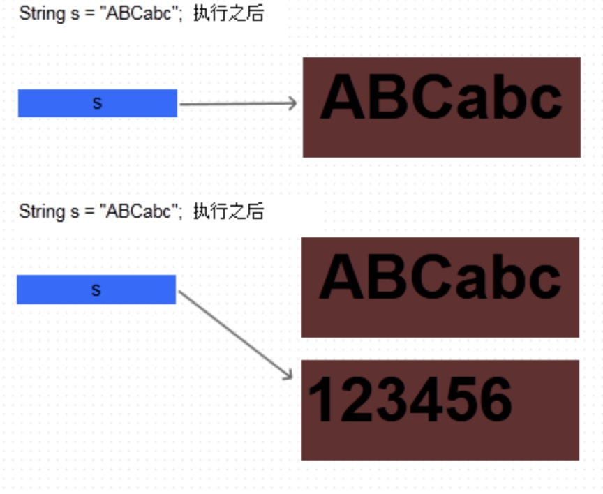

# 什么是不可变的
众所周知， 在Java中， String类是不可变的。那么到底什么是不可变的对象呢？
可以这样认为：如果一个对象，在它创建完成之后，不能再改变它的状态，那么这个对象就是不可变的。不能改变状态的意思是，不能改变对象内的成员变量，包括基本数据类型的值不能改变，引用类型的变量不能指向其他的对象，引用类型指向的对象的状态也不能改变。


# 为什么String是final的

用过Java代码的肯定都用过String，也都知道String是final类型的，但是为什么String是final的呢？网上很多文章讲的都是String是怎么做到的final，下面我们来讲解一下String为什么是final?
我们先看个例子:
```java
class MyString{
    private String str;
    public String getStr() {
        return str;
    }
    public void setStr(String str) {
        this.str = str;
    }
}

public class Main{
    static void printStrs(MyString str){
        System.out.println(str.getStr());
        //不小心改变了str的值
        str.setStr("不好！！！ 我变成了另外的一个值bbb");
    }
    public static void main(String[] args) {
        MyString str = new MyString();
        str.setStr("我是值aaa");
        printStrs(str);

        //真正再使用时就变成另外的值了
        System.out.println(str.getStr());
    }
}
```
输出结果:
```java
我是值aaa
不好！！！ 我变成了另外的一个值bbb
```
这个例子里我们自定义了一个可变的String类，在调用printStrs时不小心改变了输入的参数，那么外面使用这个String时也有了变化，就出现了意料不到的结果。

我们知道Java里有8种基础类型，通常情况下，我们使用这8种基础类型时不希望外界改变它的值，否则我们代码里就会出现一堆的if else来处理这种问题，当然，我们使用String时也是不希望它可变，所以String才设置为了不可变(final)的类型。

# String是怎么做到final的
为了解释String怎么做到不可变的(final)，我们还是要从源码入手。
String部分源码:
```java
public final class String
    implements java.io.Serializable, Comparable<String>, CharSequence {
    /** The value is used for character storage. */
    private final char value[];

    /** Cache the hash code for the string */
    private int hash; // Default to 0
    //....没有任何Set方法修改value[]的值
}
```
通过String的源码来看，String的不可变性满足一个类的不可变的几大原则:
1. 类添加final修饰符，保证类不被继承。
如果类可以被继承会破坏类的不可变性机制，只要继承类覆盖父类的方法并且继承类可以改变成员变量值，那么一旦子类以父类的形式出现时，不能保证当前类是否可变。

2. 保证所有成员变量必须私有，并且加上final修饰
通过这种方式保证成员变量不可改变。但只做到这一步还不够，因为如果是对象成员变量有可能再外部改变其值。所以第4点弥补这个不足。

3. 不提供改变成员变量的方法，包括setter
避免通过其他接口改变成员变量的值，破坏不可变特性。

4. 通过构造器初始化所有成员，进行深拷贝(deep copy)
如果构造器传入的对象直接赋值给成员变量，还是可以通过对传入对象的修改进而导致改变内部变量的值。例如：
```java
public final class ImmutableDemo {
    private final int[] myArray;
    public ImmutableDemo(int[] array) {
        this.myArray = array; // wrong
    }
}
```
这种方式不能保证不可变性，myArray和array指向同一块内存地址，用户可以在ImmutableDemo之外通过修改array对象的值来改变myArray内部的值。
为了保证内部的值不被修改，可以采用深度copy来创建一个新内存保存传入的值。正确做法：

```java
public final class MyImmutableDemo {
    private final int[] myArray;
    public MyImmutableDemo(int[] array) {
        this.myArray = array.clone();
    }
}
```
5. 在getter方法中，不要直接返回对象本身，而是克隆对象，并返回对象的拷贝

# 图解String的不可变性
最后我们用一段代码和一张图来解释一下String的不可变性。
```java
String s = "ABCabc";
System.out.println("s = " + s);

s = "123456";
System.out.println("s = " + s);
```
s在内存中的结构如下图:

